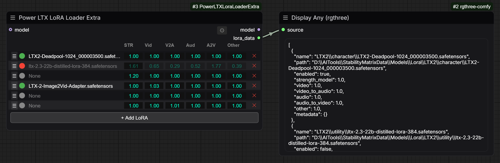

# Power LTX LoRA Loader Extra

A powerful LoRA management node for ComfyUI that enables precise, layer-specific control over multiple LoRAs in LTX2 video generation workflows.



## Features

- **Multi-LoRA Support**: Load and apply multiple LoRAs simultaneously with individual strength controls
- **Layer-Specific Strength Control**: Fine-tune LoRA influence across different network layers:
  - **STR** (Strength Model): Overall model strength
  - **Vid** (Video): Video attention layers
  - **V2A** (Video-to-Audio): Cross-modal attention (video → audio)
  - **Aud** (Audio): Audio-specific layers
  - **A2V** (Audio-to-Video): Cross-modal attention (audio → video)
  - **Other**: Remaining network components
- **Intuitive UI**: Drag-and-drop row reordering, toggle enable/disable, quick click-to-edit values
- **Optional Model Input**: Use as a standalone LoRA manager even without a model input
- **JSON Output**: Export a rich JSON structure of all selected LoRAs for external processing
- **Sidecar Metadata Support**: Automatically loads metadata from `.json` sidecar files alongside LoRA weights

## Installation

1. Clone or download this repository into your ComfyUI `custom_nodes` directory:
   ```bash
   cd ComfyUI/custom_nodes
   git clone https://github.com/yourusername/ComfyUI-PowerLTXLoraLoaderExtra.git
   cd ComfyUI-PowerLTXLoraLoaderExtra
   ```

2. Restart ComfyUI or reload the browser page.

3. The node will appear in the node menu under **Loaders > Power LTX LoRA Loader Extra**.

## Usage

### Basic Workflow

1. Create a **Power LTX LoRA Loader Extra** node
2. Connect a model input (optional — the node works standalone)
3. Click **+ Add LoRA** to add rows
4. Click the LoRA name field to open a searchable menu of available LoRAs
5. Adjust strength values by:
   - **Dragging** left/right for fine control
   - **Single clicking** to open a text input for exact values
6. Toggle the **●** circle on/off to enable/disable individual LoRAs
7. Drag rows by the **≡** grip to reorder
8. Click **✕** to delete a row

### UI Elements

| Element | Action | Purpose |
|---------|--------|---------|
| **≡** (Grip) | Drag vertically | Reorder LoRA rows |
| **●** (Toggle) | Click | Enable/disable the LoRA |
| **LoRA Name** | Click | Open searchable LoRA selection menu |
| **STR, Vid, V2A, Aud, A2V, Other** | Drag or click | Adjust layer-specific strengths (0.00–∞) |
| **✕** (Trash) | Click | Delete the row |
| **+ Add LoRA** | Click | Add a new empty row |

### Outputs

- **Model**: The input model with all active LoRAs applied
- **lora_data**: JSON string containing metadata for all selected LoRAs (enabled and disabled)

### Example Output

The `lora_data` output includes all LoRAs with selected weights:

```json
[
  {
    "name": "my_lora.safetensors",
    "path": "/path/to/my_lora.safetensors",
    "enabled": true,
    "strength_model": 1.0,
    "video": 0.8,
    "video_to_audio": 1.0,
    "audio": 0.5,
    "audio_to_video": 1.0,
    "other": 1.0,
    "metadata": {...}
  }
]
```

## Workflow JSON Editing

For hand-editing workflows in your favorite text editor:

1. Open the workflow JSON file
2. Locate your node's `properties.lora_data` field (it's a proper JSON array, not escaped)
3. Edit the LoRA list directly:

```json
"properties": {
  "lora_data": [
    {
      "on": true,
      "lora": "my_lora.safetensors",
      "str": 1.0,
      "vid": 0.8,
      "v2a": 1.0,
      "aud": 0.5,
      "a2v": 1.0,
      "other": 1.0
    }
  ]
}
```

4. Save and reload in ComfyUI — changes will be reflected in the node UI

## Key Differences from Power Lora Loader

This node extends the original **Power Lora Loader** concept with:

- **Layer-specific strength control**: Separate sliders for video, audio, and cross-modal attention (essential for LTX2)
- **Disabled LoRA tracking**: LoRAs can be toggled off without removing them from the config
- **JSON output port**: Easy integration with downstream nodes or external tools
- **Responsive UI**: The LoRA name column expands when the node is widened
- **Improved interaction**: Better drag-to-reorder, click-to-edit, and visual feedback

## Troubleshooting

### LoRA doesn't appear in the menu
- Ensure the LoRA file is in your ComfyUI `models/loras` directory
- Refresh the page or restart ComfyUI

### Disabled LoRAs don't affect the model
- Disabled LoRAs (toggle off) are kept in your configuration but not applied to the model
- Your full configuration (including disabled LoRAs with their values) is preserved in the workflow

### Can't shrink the node after expanding it
- Drag the node's resize handle (bottom-right corner) to make it narrower
- The node enforces a minimum width of 500px to keep the UI usable

## License

Apache 2.0.  In LICENSE.md

## Credits

Based on the **Power Lora Loader** concept, extended with layer-specific strength control and LTX2 support.

## Contributing

Contributions, bug reports, and feature requests are welcome! Please open an issue or submit a pull request.
